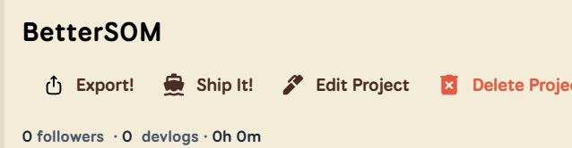

# BetterSOM

A browser extension for https://summer.hackclub.com to add extra features and display some more data (data part coming soon)

## Tech Stack

Just Javascript for the extension itself and HTML, CSS and JS for the demo site!

## Installation/Usage

First, Download the .zip from https://ilikemice.github.io/BetterSOM !

### Chrome

1. Go to chrome://extensions/ or navigate to Extensions in the top right
2. Enable Developer Mode in the top right
Unzip the .zip file you downloaded!
3. A Bar with some options should appear, click "Load unpacked" (usually first option)
4. Navigate to the unzipped folder and select the "src" Folder/ the manifest.json file
5. Done! Now you can go to https://summer.hackclub.com and use the Extension!
### Firefox

1. Go to about:debugging in the search bar and select "This Firefox" in the sidebar.
2. Under "Temporary Extensions", select "Load Temporary Add-on"
3. Then, unzip the folder and select the manidest.json file!
4. Done!

For now the Extension only has an export feature, where it exports the devlogs to a markdown file (without images for now).
You can use it by just going onto any project, and clicking the export button that appears!
